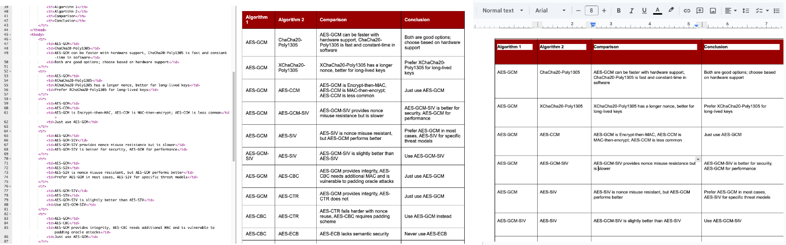

<H1> Demo of how CSV table can be translated to html </H1>

<H2> Instruction how to create table on googledoc </H2>
Post processing with 

, use online html editor, e.g. 
, then copy paste to googledoc. 

<pre>
Certain tags and sections, e.g. `< body >`, `< html >`, etc, removed from html version and used for readme.md.
</pre>

## Draft Timetable

The following is the draft timetable:

<table>
        <thead>
            <tr>
                <th>No</th>
                <th>Date</th>
                <th>Subject</th>
                <th>Lab</th>
            </tr>
        </thead>

<tbody>
            <tr>
                <td>1</td>
                <td>17 Jan 2020</td>
                <td>Quantum Mechanics</td>
                <td>Lab <a href="https://ursa.com/lab01.pdf">Link</a> Demo <a href="https://www.youtube.com/watch?v=Lm9SZf2XFCc">Link</a></td>
            </tr>
            <tr>
                <td>2</td>
                <td>24 Jan 2020</td>
                <td>Classical Mechanics</td>
                <td>Lab <a href="https://ursa.com/lab02.pdf">Link</a> Demo <a href="https://www.youtube.com/watch?v=83QCm3LkuEg">Link</a></td>
            </tr>
            <tr>
                <td>3</td>
                <td>31 Jan 2020</td>
                <td>Thermodynamics</td>
                <td>Lab <a href="https://ursa.com/lab03.pdf">Link</a></td>
            </tr>
            <tr>
                <td>4</td>
                <td>7 Feb 2020</td>
                <td>Electromagnetism</td>
                <td>Lab <a href="https://ursa.com/lab04.pdf">Link</a></td>
            </tr>
            <tr>
                <td>5</td>
                <td>14 Feb 2020</td>
                <td>Statistical Mechanics</td>
                <td>Lab <a href="https://ursa.com/lab05.pdf">Link</a></td>
            </tr>
            <tr>
                <td>6</td>
                <td>21 Feb 2020</td>
                <td>Guest lecture</td>
                <td>Mini-project/Coursework <a href="https://ursa.com/mini_project.pdf">Link</a></td>
            </tr>
            <tr>
                <td>7</td>
                <td>28 Feb 2020</td>
                <td>Optics</td>
                <td>Lab <a href="https://ursa.com/lab06.pdf">Link</a></td>
            </tr>
            <tr>
                <td>8</td>
                <td>6 Mar 2020</td>
                <td>Special Relativity</td>
                <td>Lab <a href="https://ursa.com/lab07.pdf">Link</a></td>
            </tr>
            <tr>
                <td>9</td>
                <td>13 Mar 2020</td>
                <td>Test 1 (Units 1-5)</td>
                <td><a href="https://ursa.com/test01.pdf">Link</a></td>
            </tr>
            <tr>
                <td>10</td>
                <td>20 Mar 2020</td>
                <td>General Relativity</td>
                <td>Lab <a href="https://ursa.com/lab08.pdf">Link</a></td>
            </tr>
            <tr>
                <td>11</td>
                <td>27 Mar 2020</td>
                <td>Particle Physics</td>
                <td>Lab <a href="https://ursa.com/lab09.pdf">Link</a></td>
            </tr>
            <tr>
                <td>12</td>
                <td>3 April 2020</td>
                <td>Nuclear Physics</td>
                <td>Lab <a href="https://ursa.com/lab10.pdf">Link</a></td>
            </tr>
            <tr>
                <td>13</td>
                <td>10 April 2020</td>
                <td>Condensed Matter Physics</td>
                <td></td>
            </tr>
            <tr>
                <td>14</td>
                <td>Week beginning 27 April 2020</td>
                <td>Easter Break</td>
                <td></td>
            </tr>
            <tr>
                <td>15</td>
                <td>Week beginning 4 May 2020 (TBC)</td>
                <td>Coursework Hand-in <a href="https://ursa.com/coursework.pdf">Link</a></td>
                <td></td>
            </tr>

</tbody>
</table>

