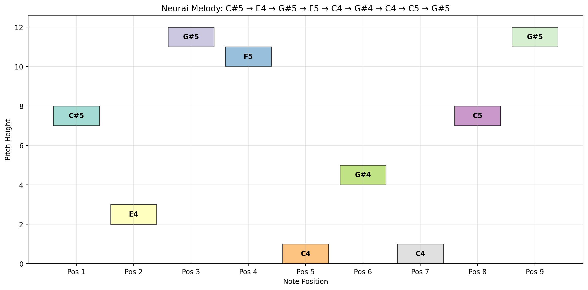

# ASCII to Audio Converter
A simple Python tool that converts ASCII text into musical melodies.



Features
```
Convert any ASCII text to musical notes

Multiple mapping strategies:
	- auto: Smart character-based mapping
	- vowel: Different notes for vowels and consonants
	- char_value: Direct character to note mapping
	- height: For ASCII art line height mapping

Generate audio playback directly in browser

Create MIDI files for external use

Visualize melodies with piano roll diagrams
```

Mapping Types
```
auto: Smart mapping (uppercase=higher, lowercase=lower, numbers=middle)
vowel: Vowels get higher notes, consonants get lower notes
char_value: Direct A=1, B=2, etc. mapping
height: Uses character position for ASCII art
binary: Uses ASCII values modulo note count
```

Output
```
Audio: Direct browser playback
MIDI: Downloadable .mid files
Visualization: Piano roll diagrams
Note Sequence: List of musical notes generated
```

Example
```
Input: "HELLO"
Output: Melody played with notes corresponding to each character
```

