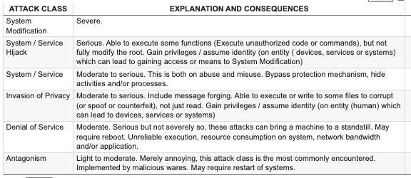
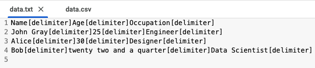
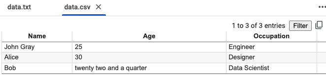
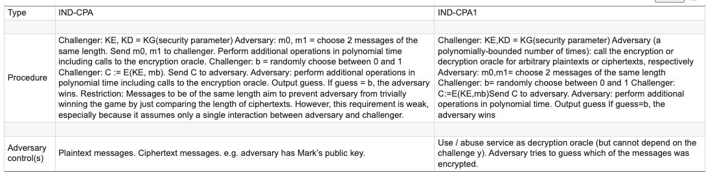

# Tabulated Data Markup Language (TDML) file into a CSV 

Usage: Write file in the tdml_file format
``` Example: 
%%writefile ./sample_data/data.txt
ATTACK CLASS [delimiter] EXPLANATION AND CONSEQUENCES [delimiter]
System Modification [delimiter] Severe. [delimiter]
System / Service Hijack [delimiter] Serious. Able to execute some functions (Execute unauthorized code or commands), but not fully modify the root. Gain privileges / assume identity (on entity ( devices, services or systems) which can lead to gaining access or means to System Modification) [delimiter]
System / Service [delimiter] Moderate to serious. This is both on abuse and misuse. Bypass protection mechanism, hide activities and/or processes. [delimiter]
Invasion of Privacy [delimiter] Moderate to serious. Include message forging. Able to execute or write to some files to corrupt (or spoof or counterfeit), not just read. Gain privileges / assume identity (on entity (human) which can lead to devices, services or systems) [delimiter]
Denial of Service [delimiter] Moderate. Serious but not severely so, these attacks can bring a machine to a standstill. May require reboot. Unreliable execution, resource consumption on system, network bandwidth and/or application. [delimiter]
Antagonism [delimiter] Light to moderate. Merely annoying, this attack class is the most commonly encountered. Implemented by malicious wares. May require restart of systems. [delimiter]

```

Run the builds:
```
!curl -O https://raw.githubusercontent.com/ursa-mikail/data_format/main/tabulated_data_markup_language_tdml_file_into_a_csv/method_01/tdml_file_into_csv.py

!git clone https://github.com/ursa-mikail/data_format.git
!cd data_format/tabulated_data_markup_language_tdml_file_into_a_csv/method_01
!python tdml_file_into_csv.py
```
Out: ./data.csv



## [Method 01]
✅ Text File Format (Before CSV)
Instead of spaces (which can appear inside data), we'll use a custom delimiter such as | or ; or any character `[delimiter]` stored in a variable delimiter.

🧪 Example Usage: 

 ➡️➡️➡️ 

<hr>

## [Method 02]
Converts a Tabulated Data Markup Language (TDML) file into a CSV file, stitching data column by column. This assumes TDML is structured as tabular data in a clear text format, rather than an XML-based format.

The script processes multiple TDML files (f1.tdml, f2.tdml, f3.tdml, etc.), automatically detecting them and converting them into a single CSV file. 🚀



